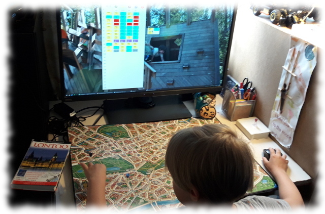

# Jokiniemi

[Jokiniemi](https://goo.gl/maps/pHLbsLvxCWHvN65N9) on [Scotland Yard](https://fi.wikipedia.org/wiki/Scotland_Yard_(lautapeli)) -lautapeliin tehty tekoälysovellus, jossa tietokone valitsee herra X:n siirrot. Näin peliä voi pelata tietokonetta vastaan niin, että pelattaessa tarvitaan kuitenkin alkuperäistä lautapeliä.

## Dokumentaatio

- [Määrittelydokumentti](dokumentaatio/maarittely.md)
- [Toteutusdokumentti](dokumentaatio/toteutus.md)
- [Testausdokumentti](dokumentaatio/testaus.md)
- [Käyttöohje](dokumentaatio/kayttoohje.md)

## Viikkoraportit

- [Viikko 1](dokumentaatio/viikko1/viikko1.md)
- [Viikko 2](dokumentaatio/viikko2/viikko2.md)
- [Viikko 3](dokumentaatio/viikko3/viikko3.md)
- [Viikko 4](dokumentaatio/viikko4/viikko4.md)

## JAR-paketti
[Viikko 4](https://github.com/artoh/Jokiniemi/releases/download/viikko4/jokiniemi-viikko4.jar)
