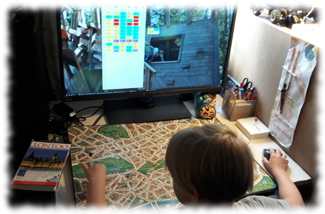

# Käyttöohje



[Jokiniemi](https://goo.gl/maps/pHLbsLvxCWHvN65N9) on [Scotland Yard](https://fi.wikipedia.org/wiki/Scotland_Yard_(lautapeli)) -lautapeliin tehty tekoälysovellus, jossa tietokone valitsee herra X:n siirrot. Näin peliä voi pelata tietokonetta vastaan niin, että pelattaessa tarvitaan kuitenkin lautapeliä tai pelin karttaa (https://boardgamegeek.com/image/407682/scotland-yard)

Peli noudattaa sääntöjen *Peliohje kahdelle pelaajalle* -variaatiota.

## Käynnistäminen

Lataa [JAR-paketti](https://github.com/artoh/Jokiniemi/releases/download/viikko6/jokiniemi.jar) ja käynnistä ohjelma komennolla

```
java -jar jokiniemi.jar
```

Ilman jar-pakettia ohjelma voidaan käynnistää komennolla

```
mvn compile exec:java -Dexec.mainClass=artoh.jokiniemi.ui.Main
```

## Pelin käynnistäminen

Paina **Uusi peli**-painiketta ja valitse avautuvasta valintaikkunasta tekoälyn taso.


## Pelaaminen


Näytön vasemmassa laidassa näet vuoronumerot. Ympäröity vuoronumero tarkoittaa, että Mr X paljastaa kyseisellä vuorolla sijaintinsa.

Mr. X. sarakkeesta näet Mr. X:n käyttämät kulkuneuvot (sekä näyttäytymissiirroilla myös sijainnin.)

Vihreä ja musta pelaaja ovat *bobbyja*, eli he saavat liikkua käyttäen taksia, bussia ja metroa ilman että he tarvitsevat matkalippuja. Keltainen ja punainen ovat puolestaan *tavallisia etsiviä*, eli heillä on yhteinen lippuvarasto (jäljellä olevien lippujen määrät näkyvät oikeassa laidassa).

Jos käytössäsi on alkuperäinen lautapeli, sijoita nyt pelinappulat pelilaudalle.

Siirrä neljää nappulaasi vapaasti valitsemassasi järjestyksessä painamalla nappulan sarakkeessa olevaa **Siirrä**-nappia.


Valitse pelaajan siirto ohjelman tarjoamista vaihtoehdoista napsauttamalla.


Pelin edetessä näet etsivien tekemät siirrot ja jäljellä olevien korttien määrän.

Mr. X saa käyttää viisi kertaa pelin aikana mustaa lippua (jolla voi käyttää mitä tahansa kulkuneuvoa, myös lauttaa). Lisäksi Mr X saa käyttää kaksi kertaa tuplavuoron eli tehdä kaksi siirto peräkkäin.

## Pelin päättyminen

Jos etsivä päätyy samaan ruutuun Mr X:n kanssa, peli päättyy etsivien voittoon. Mr X voittaa jos hän selviää kaikki 24 kierrosta jäämättä kiinni.

Kun peli päättyy, näytetään myös kaikki Mr X:n tekemät siirrot.

## Suorituskykytestit

Suorituskykytestien ajaminen on kuvattu [testausdokumentissa](testaus.md)
