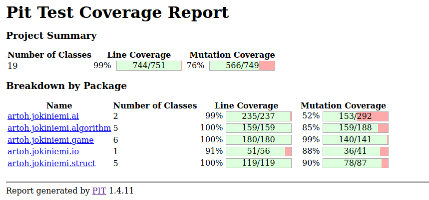
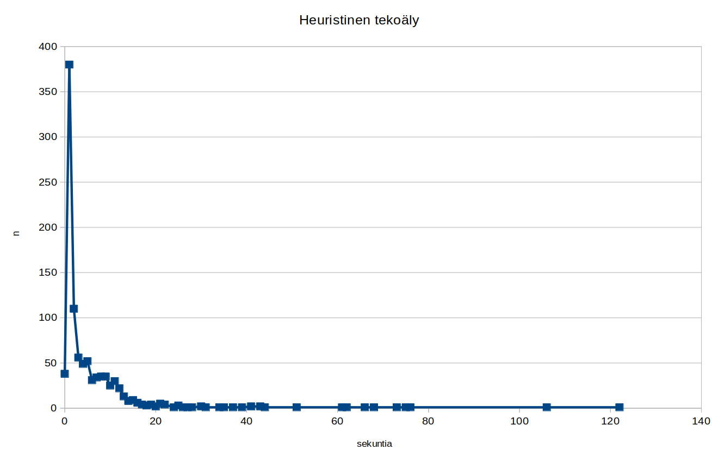

# Testausdokumentti

## Yksikkötestaus

Käyttöliittymää lukuun ottamatta ohjelmalle on toteutettu kattavat JUnit-yksikkötestit. Luokkien testaamisessa on käytetty osittain mock-olioita ja osittain luokkaan kiinteästi liittyvä toinen luokka on jo yksikkötestissä mukana.

Yksikkötestejä ei ole toteutettu niille tapahtumille, joita ohjelmassa ei ole mahdollista tulla vastaan (esim. pelilaudan lukemisessa tiedoston puuttumiselle, koska tiedosto on sisällytetty jar-pakettiin). Tekoälyä testattaessa ei juurikaan testata sitä, tekeekö teköäly aina tarkoituksenmukaisen siirron.

Testien rivikattavuus (käyttöliittymä pois luettuna) on 99%.



## Integraatiotestaus

StupidDetectiveTest -integraatiotestit suorittavat koko pelin läpi niin, että simuloitu käyttäjä tekee satunnaisia siirtoja.  

## Järjestelmätestaus

Sovellus on järjestelmätestattu manuaalisesti pelaamalla. Samalla on arvioitu tekoälyn haastavuutta ihmispelaajaa vastaan.

Tekoälyn haastavuutta on testattu myös seitsemänvuotiaalla testipelaajalla, joka onnistuu lähes aina voittamaan tietokoneen.

## Suorituskykytestaus

Ohjelmaan on integroitu yksinkertaiset suorituskykytestit etäisyyksien hakemiselle ja tekoälylle.

Testiparametri    |    Testattava asia   |  Tyypillinen tulos
----------------|----------------------|--------------------------------
test FW         | Floydin-Warshallin etäisyyksien haku |  0,03 s.
test AF         | Sovellettu Floydin-Warshallin etäisyyksien haku | 0,03 s.
test TA         | Lippujen määrät huomioiva etäisyyksien haku | 1,2 s.
test SA         | Yksinkertainen tekoäly  | 0,001 s.
test HA         | Heuristinen tekoäly     | 1 ... 17 s.

Testi suoritetaan antamalla yllä oleva parametri, esim ```java -jar jokiniemi.jar test FW```.

Yllä olevat testit on suoritettu tehokkaalla pöytäkoneella, jolla on runsaasti muistia ja ytimiä. Fuksiläppärillä testituloksien hajonta oli paljon suurempaa (liittyen ehkä koneen kuormitukseen ja kannettavan tietokoneen virranhallintaan).

Etäisyystesti hakee 20 000 kahden ruudun välistä etäisyyttä (eli noin puolet ruutujen välisistä etäisyyksistä). Ei liene yllättävää, että kaikki etäisyydet taulukkoon hakeva algoritmi on ylivoimainen verrattuna algoritmiin, jossa syvyyshakuun on yhdistetty joukko kolmeen eri lippulajiin liittyviä tarkastuksia.

Tekoälyn testi suorittaa koko 24 vuoroa kestävän pelin niin, että simuloitu käyttäjä tekee satunnaisia valintoja (vastaa ohjelman integraatiotestiä).

### Heuristisen tekoälyn suorituskykytesti


Heuristisen tekoälyn suorituskykytestin hajonta, testi suoritettuna 1000 kertaa, joista 16 päättyi etsivien voittoon. Mediaani on kaksi sekuntia, ja 95 % peleistä kestää enintään 17 sekuntia.

Hajontatestin voi suorittaa tilasto.py-apuskriptillä: ```python3 tilasto.py 1000 0 java -jar jokiniemi test AF``` suorittaa testin tuhat kertaa ja esittää ajan frekfrensiivit eri sekunneille kokonaislukuina (nollan desimaalin tarkkuus).

Heuristisen tekoälyn testin suuri hajonta johtuu testiin liittyvästä satunnaisuudesta (niin aloitusruutujen kuin simuloitujen etsivien liikkumisen suhteen): pelin tekoäly hidastuu huomattavasti silloin, kun se joutuu käyttämään hitaampaa lippujen määrän huomioivaa algoritmia arvioidessaan etsivien uhkaa Mr X:lle, ja etsivät sattuvat olemaan algoritmin kannalta äärimmäisissä sijanneissa. (Ilman lippujen määrän huomioimista TA-algoritmilla testipeliin kulunut aika vastaavassa toistokokeessa oli 0..2 sekuntia.)

1,6 % testipeleissä keskimääräinen siirtoviive olisi ollut yli sekunnin, mitä voi pitää jo liian pitkänä aikana. Käytännössä ihmispelaajat käyttävät lippujaan useimmiten niin, että hitaampaan TA-algoritmiin joudutaan turvautumaan vain aivan loppupelissä (käytännössä peleissä ei ollut havaittavissa yli puolen sekunnin siirtoviivettä). Testi osoittaa kuitenkin selkeästi, että ohjelman tehokkuuden parantamisen kannalta TA-algoritmi on kaikkein kriittisin.
