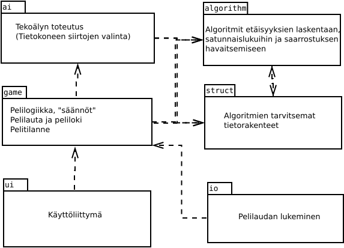

# Toteutusdokumentti

## Projektin rakenne

Pelilogiikka ei tarkasta, että pelaajan siirrot ovat laillisia, vaan luottaa tässä käyttöliittymään. Käyttöliittymä sisältää siksi jonkin verran toiminnallisuutta, joka ehkä luontevammin kuuluisi pelilogiikkaan (pelilaudalla olevien siirtovaihtoehtojen laillisuuden tutkiminen).

## Toteutetut algoritmit

Kaikki algoritmit on kuvattu tarkemmin luokan dokumentaatiossa.

### Peliruutujen välisien etäisyyksien laskeminen

Arvoidessaan etsivien uhkaa Mr X:lle peli käyttää ensisijaisesti Floydin-Warshallin algoritmia ja vain tilanteessa, jossa pelaajalla on lippuja niin vähän, että ne eivät välttämättä riitä (jollakin lipputyypillä vähemmän kuin taulukossa oleva lyhin etäisyys), haetaan etäisyys vaihtoehtoisella algoritmilla. Usein laskettu tieto lähimmin etsivät etäisyydestä tiettyyn ruutuun tallennetaan välimuistiin ja haetaan ensisijaisesti sieltä.

#### Floydin-Warshallin algoritmi

Algortimilla lasketaan kaikkien ruutujen väliset etäisyyden (vuoroissa silloin kun lippuja käytettävissä riittävästi) taulukkoon.

Tilavaativuus O(n2)
Aikavaativuus O(n3)

#### Jäljellä olevien lippujen määrän huomioiva algoritmi

Algoritmi perustuu iteratiivisesti syvenevään A* -hakuun, eli on luonteeltaan lähtöruudusta etenevä syvyyshaku, jolle on määritelty hakusyvyys. Ellei hakusyvyys riitä, kasvatetaan syvyyttä kunnes saavutetaan haun rajasyvyys. Hakusyvyyden kasvaessa algoritmi hidastuu voimakkaasti, mutta tässä sovellutuksessa jo kohtalaisen matala hakusyvyys (4...10) riittää toteamaan, että etsivä on "riittävän kaukana" Mr X:stä.

Tilavaativuus O(n)
Aikavaativuus O(mn)

### Saarroksiin joutumisen tunnistaminen

Algoritmi hakee saarretuksen tulemisen kannalta keskeiset ruudut, jotka etsivien tulisi miehittää saadakseen Mr X varmasti kiinni. Tämän jälkeen arvioidaan etäisyyksien laskenta-algoritmien perusteella etsivien ennättämistä kyseisiin ruutuihin.

Haku tehdään verkon leveyshakuun perustuvalla algoritmillä.

Tilavaativuus O(n2)
Aikavaativuus O(n3)

### Satunnaislukujen tuottaminen

#### Lineaarisesti yhdenmukainen generointi

Satunnaislukugeneraattorin tila alustetaan kellonajalla, jonka jälkeen uusi tila saadaan  *tn+1 = (a * tn + b) mod c*, missä a, b ja c ovat suurehkoja lukuja.

Tilavaativuus O(1)
Aikavaativuus O(1)

### Yksinkertainen tekoäly

VeryStupidAI arpoo tietokoneen siirron sillä hetkellä turvallisista vaihtoehdoista ja on kehitetty tyngäksi, jota vasten pelin muut osat saatiin kehitettyä.

### Heuristinen tekoäly

Tekoäly pisteyttää kaikki mahdolliset siirtovaihtoehdot ja valitsee parhaiten pisteytetyn. Pisteytykseen vaikuttavat

- mahdollisuus päästä pakenemaan turvallisesti pelin loppuun asti (maksimipisteet)
- mahdollisuus joutua etsivien saartamaksi
- mahdolisuus salata oma sijainti ottaen huomioon käytetyt lipputyypit
- mahdollisuus päästä liikkumaan ruudusta eteenpäin moneen paikkaan
- etäisyys lähimpään etsivään

Pisteytystä laskettaessa tarvitaan tietoa etsivien mahdollisuudesta saavuttaa vaihtoehtoiset ruudut, niiden takana olevat ruudut sekä saarretuksi tulemisen kannalta keskeiset ruudut. Siksi käytännössä nopeuteen vaikuttaa eniten se, kuinka nopeasti tarvittavat etäisyydet saadaan lasketuksi.

### Mahdollisten etäisyyksien taulu

Peli pitää yllä binääritaulua siitä, missä ruuduissa Mr X voisi käyttämiensä lippujen perusteella olla (eli kuinka hyvät mahdollisuudet Mr X:llä on sijaintinsa salaamisessa). Vuoron jälkeen taulukkoa päivitetään leveyshaulla O(nm), missä n ja m ovat kuitenkin pieniä lukuja.

## Parannusmahdollisuuksia

## Lähteet
