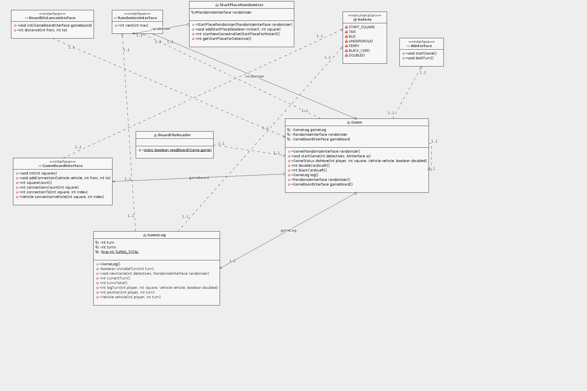

# Viikkoraportti 1

Aikaa käytetty n. 12 tuntia

## Mitä olen tehnyt

- Aiheen ja toteutuksen miettiminen
- Verkkoihin liittyvien algoritmien mieleen palauttaminen
- Algoritmeihin tutustuminen: satunnaislukujen tuottaminen sekä pelipuiden käsittely
- Määrittelydokumentin kirjoittaminen ja käytettävien algoritmien hahmottaminen
- Pelin datatiedoston luominen
- Esitöinä datatiedoston tutkiminen python-ohjelman avulla (mm. ruutujen välisen enimmäisetäisyyden määrittäminen)
- Ohjelman rajapintojen hahmottaminen

## Miten ohjelma on edistynyt

Ohjelmalle on hahmoteltu pakkausrakennetta ja rajapintoja, joille on kirjoitettu alustava JavaDoc

## Mitä opin

- Olen päässyt pohtimaan deterministisyyden merkitystä pelin tekoälyn toteuttamiseen. Tässä pelissä haasteena on se, että ihmispelaajalla ei ole kaikkea tietoa käytettävissään (jos olisi, peli päättyisi vääjäämättä tietokoneen tappioon), niinpä päättelyssä on käytettävä hieman toisenlaista lähestymistapaa.
- Uutta on ollut myös tutustuminen (pseudo)satunnaislukujen luomisen menetelmiin

## Haasteet
- Sen määrittäminen, kuinka haastavat algoritmit ovat kurssille riittäviä ja kuinka paljon algoritmeja voi tuunata ottaen huomioon juuri tämä aineisto (esim. se, että verkko on rakennettu siten, että maksimietäisyys on 10 vuoroa)
- Se, ettei ole koodannut Javalla moneen kuukauteen, tuo tietynlaista kankeutta käyntiin lähtemiseen...

## Mitä teen seuraavaksi
- Verkon lataaminen (BoardFileReader), tallentaminen muistiin (GameBoard) ja siihen liittyvä etäisyyksien laskenta (GameBoardDistance) ja niiden testit sekä Checkstylen ja testikattavuuden seurantojen käyttöön ottaminen.
