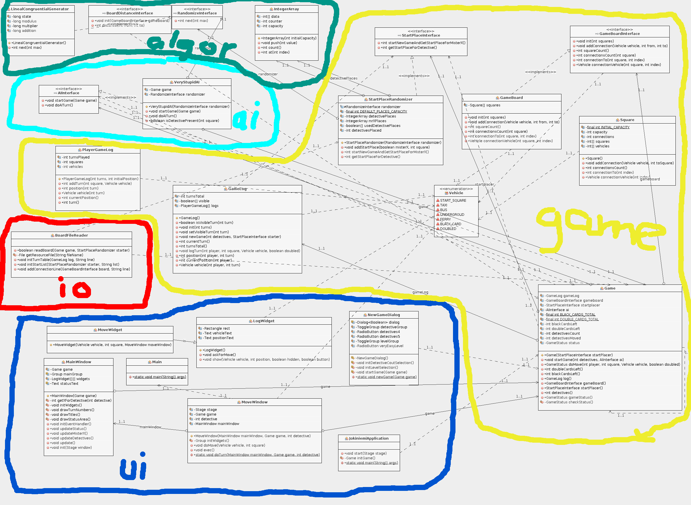
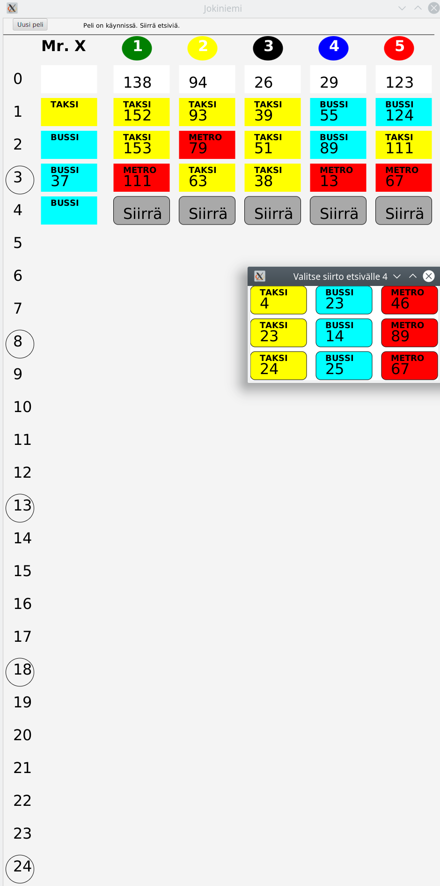
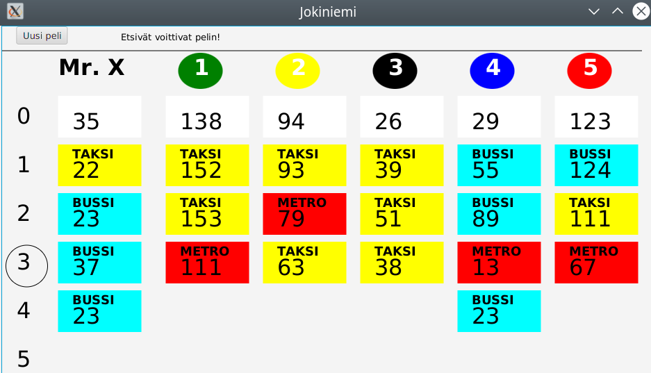
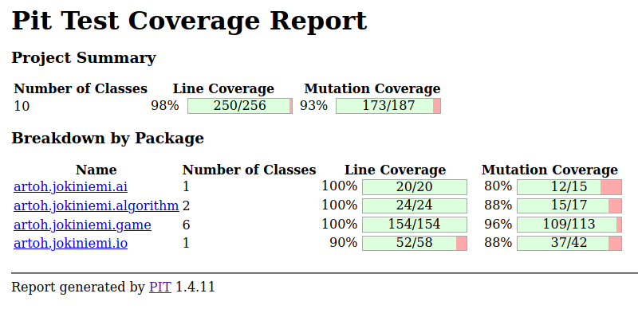
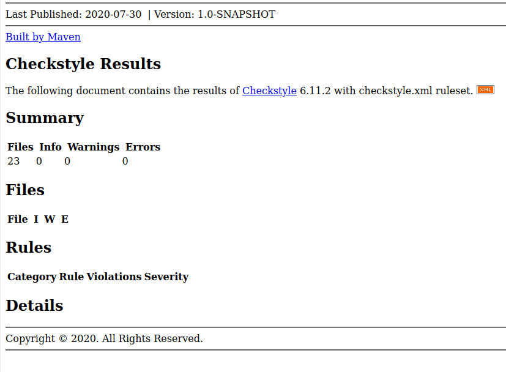

# Viikkoraportti 2

Aikaa käytetty n. 18 tuntia

## Mitä olen tehnyt

- Peliin tarvittava sääntöjen logiikka eli **game**-pakkaus on pääosin toteutettu
- Samoin on toteutettu pelilaudan lukeminen **io**-pakkauksessa
- Algoritmien puolella on toteutettu LinealCongruentialGenerator -algoritmin satunnaisluvun generointi
- Pelin käyttöliittymä eli **ui**-pakkaus on toteutettu niin, että peli on sujuvasti pelattavissa
- Tekoälystä on toteutettu **VeryStupidAI**-tynkä, joka käytännössä arpoo tietokoneen valinnat käytettävissä olevista vaihtoehdoista
- Käyttöliittymää lukuun ottamatta em. on toteutettu yksikkötestit

## Miten ohjelma on edistynyt

Ohjelmasta generoitu luokkakaavio

Ja kuvaruutukaappaus ensimmäisestä pelistä

... joka päättyi varsin nopeasti etsivien voittoon

## Testikattavuus

## Mitä opin

- LinealCongruentialGenerator -algoritmin toteuttaminen
- Käyttöliittymän tekeminen JavaFX:lla tarkoittaa aina melkoista ohjeiden kahlaamista, koska aina tulee vastaan paljon sellaista, jota ei ole ennen tehnyt.

## Haasteet

- Sopivien testien tekeminen (esimerkiksi tekoälyn ja satunnaislukugeneraattorin testaamisessa). Vaikka testit ovat periaatteessa varsin kattavat, silti käyttöliittymän kautta peliä käyttäessä tuli vastaan virheitä, joita testi ei napannut kiinni.
- Myös pelilaudan datasta paljastui testikäytössä pieniä vajavuuksia...

## Mitä teen seuraavaksi

Nyt ohjelman "puitteet" alkavat olla valmiita, eli pääsee keskittymään varsinaiseen algoritmiseen puoleen.

- Ensimmäisenä vastassa on verkon etäisyyksien laskenta-algoritmin (aluksi Floydin-Warshallin algoritmilla) toteuttaminen
- Tämän jälkeen pääsee toteuttamaan parempaa tekoälyä.
