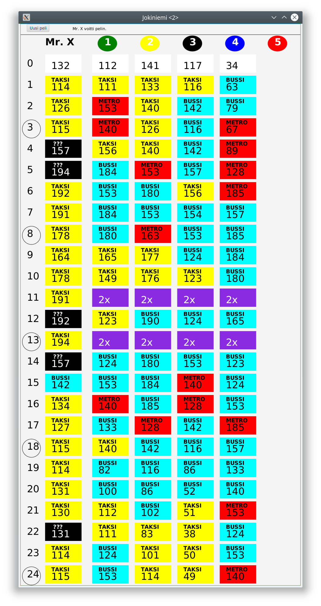
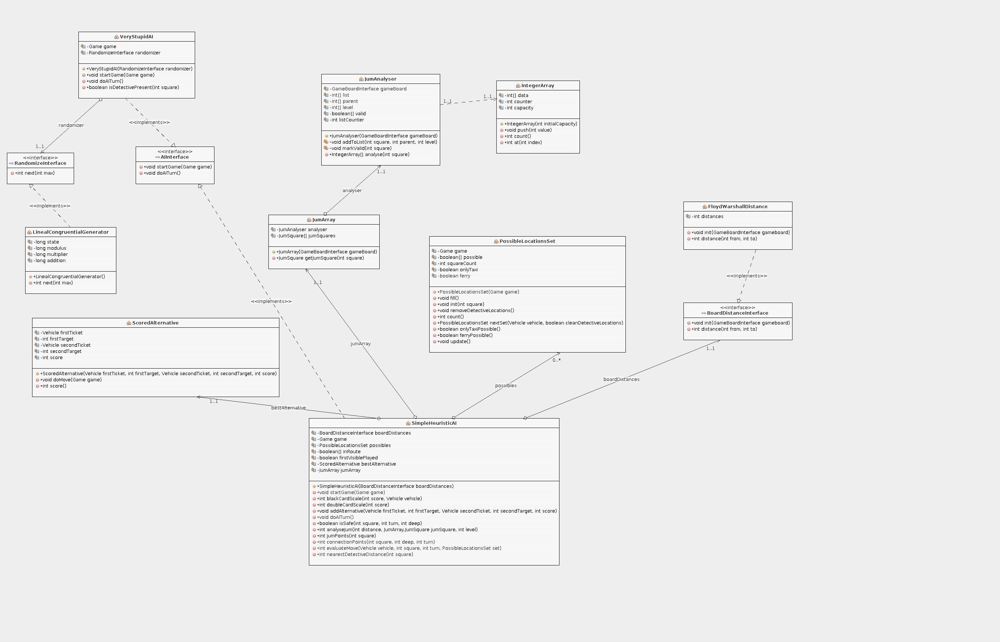
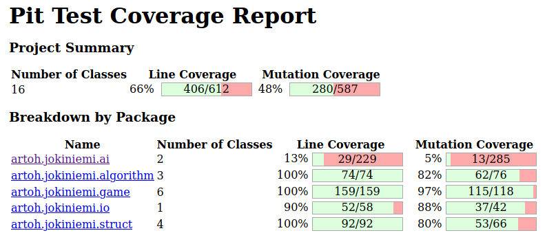
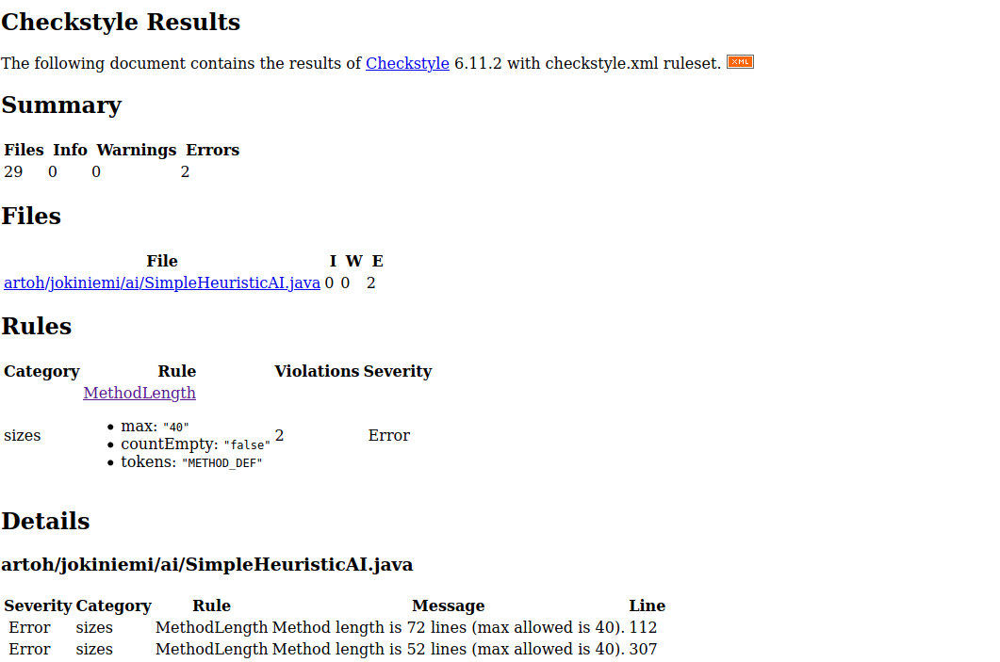

# Viikkoraportti 3

Aikaa tällä viikolla käytetty n. 32 tuntia 

## Mitä olen tehnyt

Aloitin toteuttamalla ruutujen välisen etäisyyden laskemisen Floyd-Warshallin algoritmilla. Tämän avulla aloin toteuttamaan heuristista tekoälyä, joka perustuu kaikkien vaihtoehtojen pisteyttämiseen.

Järkevän pisteytysalgoritmin luominen osoittautui hyvin haastavaksi. Pisteyttämisen avuksi loin kaksi vähemmän triviaalia tietorakennetta. PossibleLocationsSet pitää yllä tietoa ruuduista, joissa Mr X voisi etsivien kannalta (käyttämiensä lippujen puolesta) sijaita - tätä käytetään, jotta AI pyrkisi valitsemaan liikkumistapoja, joiden avulla etsivät eivät tiedä hänen sijaintiaan. Vielä hämärämpää algoritmiikkaa on JumAnalyserin luoma JumArray, joka pyrkii arvioimaan etsivien mahdollisuutta saartaa Mr. X pelilaudan eri ruutuihin.

Alkuperäinen ajatus valita eri mahdollisuuksista pisteytyksen mukaisten painokertoimien mukaisesti arpomalla osoittautui myös huonoksi: peli pärjää paremmin valitsemalla yksinkertaisesti aina parhaaksi pisteyttämänsä vaihtoehdon, vaikka ihmispelaaja saataakin pystyä tämän takia hieman päättelemään tietokoneen siirtoja.

Tekoäly häviää pelin useimmiten jo ennen puoliväliä. Yhden kerran tekoäly onnistui päihittämään ihmispelaajan tekemällä vuorolla 13 ovelan kaksoissiirron, jolla pääsi pakenemaan lautalla etsivien saarrosta:

Pelin tasapainoituksen kannalta rajoitetut matkaliput ovat niin olennaisessa roolissa, että niiden jättäminen toteuttamatta (ohjelman yksinkertaistamisen takia) osoittautui huonoksi valinnaksi. Peliin olisikin syytä toteuttaa pelaajan korttien rajaaminen esim. muuttamalla pelimuodoksi pelin sääntöjen mukainen kaksinpeli (jossa pelaajalla on kaksi nappulaa yhteisellä korttivarastolla ja kaksi "bobbyä" jotka eivät tarvitse lippuja).

# Miten ohjelma on edistynyt

Ohjelman logiikkapuolelle on toteutettu useita uusia luokkia:

*Luokkakaaviossa ainoastaa ai ja struct-pakkauksen luokat*

Tekoälyn hiominen on vaatinut paljon erilaista tuunaamista testipelien perusteella. SimpleHeuristicAI luokka onkin menossa refektoroitavaksi nyt kun peruslogiikka on selvillä ja ohjelmaan lisätään lippujen rajallisuus. Samalla myös SimpleHeuristicAI:lle luodaan yksikkötestit.

# Mitä opin
Opin toteuttamaan JUnitin yksikkötesti abstraktin kantaluokan avulla rajapintoja vastaan (BoardDistanceInterface). Myös testaamisessa yksinkertaisten mokkien tekeminen sujuu koko ajan paremmin.

# Haasteet
Mielenkiintoinen projekti vie paljon aikaa (etenkin jollain tavalla järkevän pisteytysfunktion laatiminen osoittautui vaikeaksi).

# Mitä seuraavaksi
Peliin otetaan mukaan etsivien matkalippujen rajallinen määrä (vaatii muutoksia moneen paikkaan läpi ohjelman). Tämä tarkoittanee sitä, että tilanteessa, jossa etsivien lippujen määrä muodostaa rajoitteen, otetaan käyttöön syvyyshakuun perustuva erikoistettu etäisyydenlaskenta-algoritmi, joka etsii vain niitä reittejä, joihin etsivien matkaliput riittävät.
