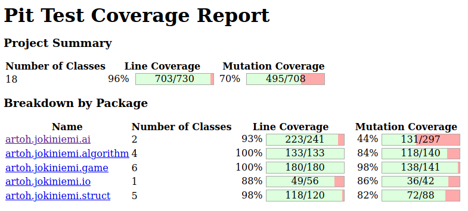

# Viikkoraportti 4

Aikaa tällä viikolla käytetty n. 14 tuntia

## Mitä olen tehnyt

Refaktoroin **SimpleHeuristicAI** -luokan ja toteutin sille testit. Samalla eriytin usein käytettävän tiedon etäisyydestä lähimpään etsivään **NearestDetectiveCache** -luokaksi, joka toteuttaa myös välimuistin niin, että etäisyys lasketaan vain, jos sitä ei ole laskettu tällä vuorolla.

Toteutin **TicketAwareDistance** -luokan joka laskee etäisyyden siinä tapauksessa, että etsivä ei välttämättä voi käyttää lyhintä reittiä koska hänellä ei ole riittävästi matkalippuja.

Tein ohjelmalle **StupidDetectiveTest** -integraatiotestit, jotka auttoivat myös mitoittamaan TicketAwareDistancea hyödyntävien hakujen hakusyvyyttä (iteratiivisesti kasvavaan syvyyshakuun perustuva algoritmi käy todella hitaaksi syvyyden kasvaessa riittävästi).

Toteutin yksinkertaiset suorituskykytestit etäisyyksien hakemiselle ja tekoälylle sekä aloitin toteutus- ja testausdokumentit.

## Miten ohjelma on edennyt

Ohjelma ottaa nyt huomioon myös matkalippujen loppumisen. Tosin useimmissa peleissä mr X ehtii jäädä kiinni jo ennen kuin etsivien lippuja ylipäätänsä tarvitsee ottaa huomioon.

Muuten ohjelman muutokset ovat ohjelman sisäisen laadun parantamisessa. Testien yhteydessä joitain yksittäisiä parametreja on muutettu suorituskykyä paremmin huomioon ottaviksi.

Testien rivikattavuus on nyt 96 % ja checkstyle kunnossa

## Mitä opin

Syvyyshaun maksimisyvyyden määritteleminen suorituskyvyn huomioon ottavaksi on ollut opettavaine kokemus,

## Haasteet

Tässä vaiheessa alkaa tulle vastaan ohjelmointiprojektin tyypillinen ongelma: sen päättäminen, mitä vielä viilaa ja minkä uskaltaa todeta riittävän hyväksi...

## Mitä seuraavaksi

- Floydin-Warshallin algoritmi on nyt toteutettu oppikirjatoteutuksena: mahtaisiko reittien symmetrisyys ja yhteyksien samanpainoisuus antaa mahdollisuuden vielä tuunata algoritmin toteutusta?
- Tekoälyn heikkouksien paikantamista ja parantamista
- Testien täydentämistä
